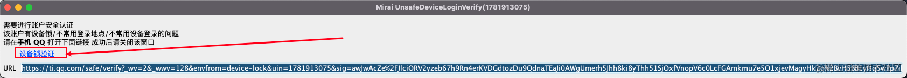

# richguy

- 决战大a

- 环境：Java 11+

- 项目依赖 [zfoo](https://github.com/zfoo-project/zfoo) ，运行前先使用Maven install [zfoo](https://github.com/zfoo-project/zfoo)

- Excel配置KeyWordResource.xlsx所表示的关键词在电报的内容中出现


- 此项目仅供学习参考，如果用在其它用途本人概不负责

- 抓取方法

```
1. 将spider文件夹的package.json使用node的npm install，安装js的依赖文件
2. 抓取行业和概念，IndustryTest中运行allIndustryListlTest，将这些行业概念复制到IndustryResource.xlsx中
3. 抓取概念的真实id，SpiderIndustryTest中运行industryToRealIndustryTest，将这些行业概念复制到IndustryResource.xlsx中的realCode
4. 抓取业和概念对应的股票信息，SpiderIndustryTest中运行industryStockTest，将这些行业概念复制到IndustryStockResource.xlsx中
5. 抓取所有股票信息，SpiderStockTest中运行stockTest，将股票信息复制到StockResource.xlsx中
```

# qq机器人启动

- 直接启动 ApplicationTest.deviceJson 按照提示生成合法的device.json
- 最后启动 ApplicationTest.startApplication 完成验证码登录过后，就能得到一个完整的device.json，复制到服务器的同级运行目录

- [如何通过滑动验证助手去通过安全认证登录](https://blog.csdn.net/qq_41804775/article/details/123988487)

- [TxCaptchaHelper 验证码输入app](https://github.com/mzdluo123/TxCaptchaHelper)，需要输入一个4位数字的验证码

-

- 验证完成把链接复制到手机qq中打开，然后扫码登录